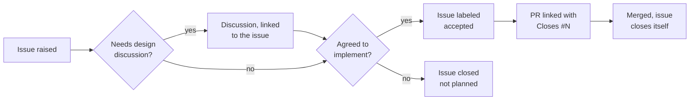

# Contributing

Thanks for wanting to help. This project tracks **all** work through issues —
an issue is the record of a piece of work from "someone thought of it" to
"a PR closed it". If work is happening, there's an issue for it.

## How work moves



### 1. Raise an issue

Everything starts here — features, bugs, and documentation fixes alike. For a
one-line typo the issue can be one sentence; the point isn't ceremony, it's
that the work is visible and has somewhere to hang the conversation.

Say what you want to happen and why. If it's a bug, include what you ran, what
you expected, and what happened instead. If it touches existing behavior, name
the file or the command — the existing issues are a reasonable model for the
level of detail that's useful.

Search open issues first; if one already covers your case, add to it rather
than opening a second.

### 2. Discuss it, if it needs discussing

Anything with a design question — a new UI concept, a config format, a change
to how flows are stored — is worth a
[Discussion](https://github.com/citizen-123/cli-capture/discussions) before
code exists. Link the Discussion back to the issue, and link the issue from the
Discussion, so neither is a dead end.

The split is deliberate:

- The **issue** is the tracking record. It has a state, a label, and eventually
  a PR.
- The **Discussion** is where the argument happens — options, tradeoffs, people
  disagreeing about the right shape.

Threads that resolve into "here's what we'll do" belong summarized back on the
issue, so nobody has to read the whole Discussion to know the outcome.

Small, obvious changes don't need this step. A bug with one sensible fix can go
straight from issue to PR.

### 3. Wait for it to be accepted

When the discussion resolves and the change is agreed, a maintainer labels the
issue **`accepted`**. That label is the green light: it means the feature is
wanted, the shape is settled, and a PR for it will be reviewed on its merits
rather than re-litigated from scratch.

**Please don't start building an unaccepted feature issue.** Not because the
work isn't welcome, but because it's a bad trade for you — an unaccepted issue
is one where the maintainers haven't yet agreed the thing should exist, and a
finished PR is an expensive way to discover that.

Bugs and documentation fixes don't need `accepted` — just go.

### 4. Open a PR that links the issue

Branch off `main`, keep the change focused on the one issue, and put a closing
keyword in the PR description:

```
Closes #12
```

That link is required, and not just as bookkeeping: it's what closes the issue
on merge and what lets someone reading the history six months from now find the
reasoning behind a change. A PR with no issue behind it will get one asked for.

Before you push:

```bash
go build ./...
go vet ./...
go test -race ./...
```

CI runs the same three on every PR. It skips the build entirely for changes
that only touch documentation — see `.github/scripts/needs-build.sh` for the
exact rule — so a docs PR going green in seconds is expected, not a mistake.

## Labels

| Label | Meaning |
|---|---|
| `accepted` | agreed to be implemented — safe to start work |
| `enhancement` | a feature request |
| `bug` | something isn't working |
| `documentation` | docs only |
| `good first issue` | small and self-contained; a reasonable place to start |
| `help wanted` | maintainers would particularly welcome a PR |

## Working on the code

```bash
git clone https://github.com/citizen-123/cli-capture
cd cli-capture
go build -o cli-capture ./cmd/cli-capture
./cli-capture -- curl https://example.com
```

[docs/ARCHITECTURE.md](docs/ARCHITECTURE.md) explains how the pieces fit —
worth reading before a first change, particularly the split between transport
capture and protocol parsing, which is the thing most likely to make a change
land in the wrong package. The [docs](docs/) cover the tool from a user's side.

A few conventions the existing code follows:

- Comments explain *why*, not what. The interesting comments in this codebase
  are the ones justifying a decision.
- New behavior comes with a test. `internal/` is well covered; match what's
  around you.
- `gofmt` before committing.

## One thing to be careful about

cli-capture captures live traffic verbatim — auth headers, cookies, tokens, and
full request bodies. Session files, HAR exports, and `flagged.txt` all contain
whatever the target sent, unredacted.

**Don't paste real captures into issues, Discussions, or PRs.** If you need to
show a flow to explain a bug, use a synthetic one against a local server, or
redact it carefully before posting. Once it's in a public thread it's public,
and edit history keeps what you removed.
