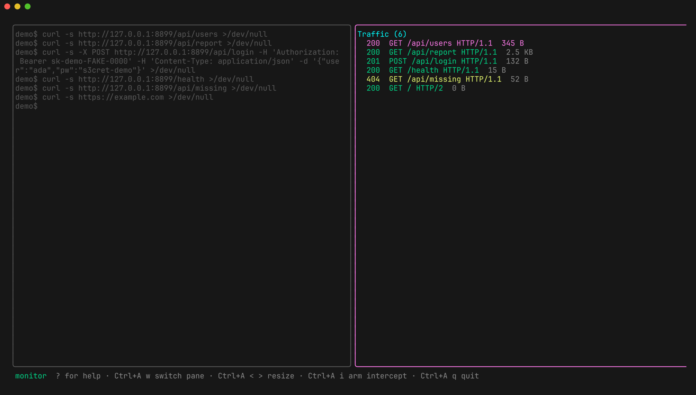
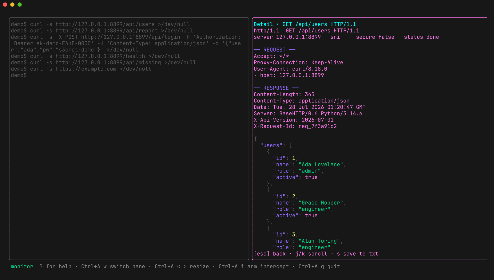
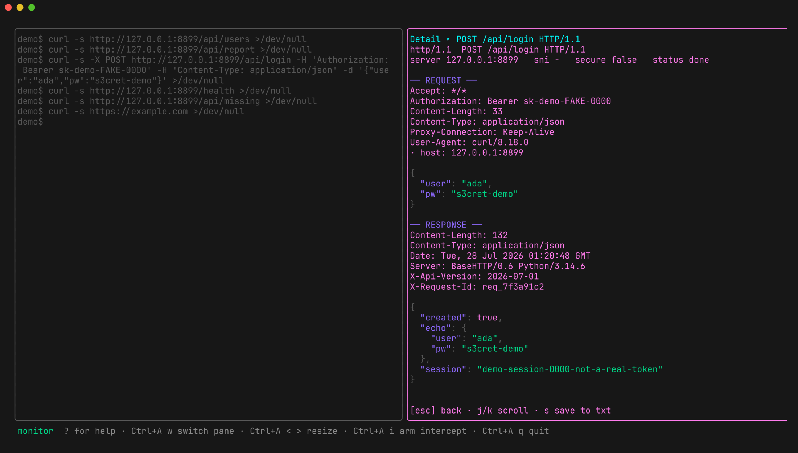
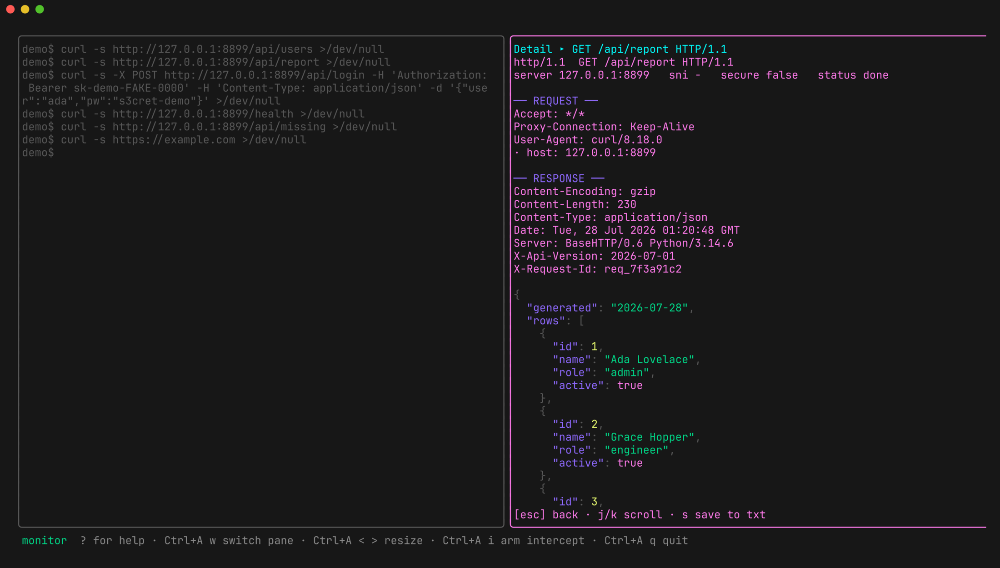
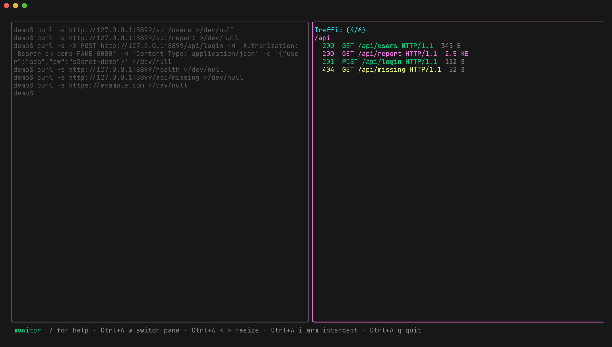
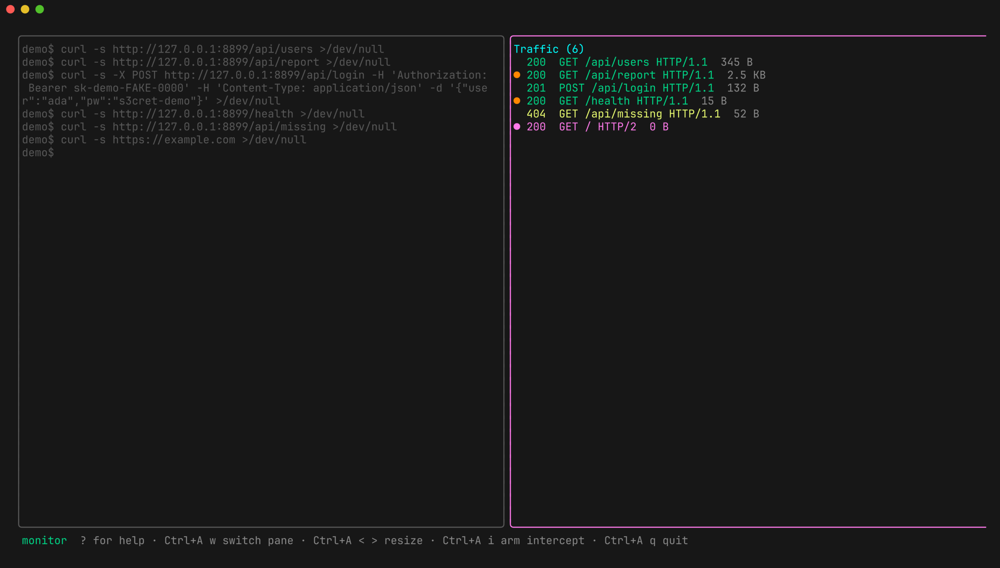
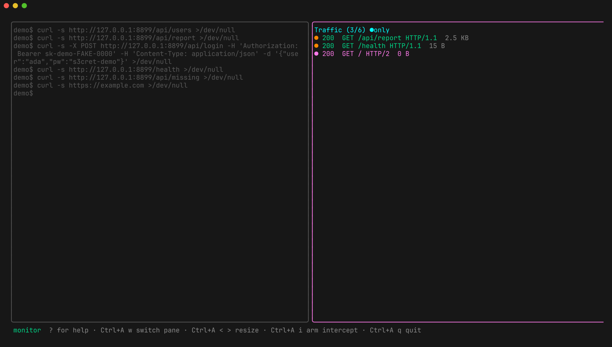

# Getting started

[Install it](../README.md#install) first — `brew install citizen-123/tap/cli-capture`,
`go install`, a release tarball, or `go build ./cmd/cli-capture`.

## Your first capture

Everything after `--` is the target program and its arguments:

```bash
cli-capture -- curl -s https://example.com
```

The target runs in the left pane exactly as it would in a normal terminal; its
traffic streams into the list on the right.



Press **`?`** at any time for the keybinding overlay, and **`Ctrl+A q`** to
quit. The leader is `Ctrl+A` — see [keybindings](keybindings.md).

## Capture a whole shell session

Give it no command at all and the target is your own `$SHELL`, running
interactively in the left pane:

```bash
cli-capture
```

Every command you run inside that shell inherits the proxy environment, so the
traffic pane fills up as you work — no need to know up front which command you
wanted to watch. Exit the shell (`exit` or `Ctrl+D`) to quit cli-capture.

## Targets your shell knows but `PATH` doesn't

A named target is launched directly, which means it must be a real executable on
`PATH`. Aliases and shell functions are not — they exist only inside your shell,
so cli-capture reports:

```text
start target: "claude-as" not found in $PATH — if it is a shell alias or
function, re-run with -shell (or launch a bare shell: cli-capture)
```

`-shell` runs the target through `$SHELL -ic` instead, which loads your rc file
first:

```bash
cli-capture -shell -- claude-as alt
```

Two things worth knowing:

- Arguments are quoted so they stay literal, but the **command name is left
  unquoted on purpose**. In zsh, quoting any part of a word suppresses alias
  expansion — a quoted name would still find a *function*, but your *aliases*
  would silently stop resolving.
- `$SHELL -ic` is an interactive shell, so some setups print an extra prompt
  line into the pane before the target's own output. Harmless, and only with
  `-shell`.

## What happens when you launch

1. A CA is loaded from (or created in) `~/.cli-capture/` on first run.
2. The proxy binds `127.0.0.1:0` — a free port, unless you pass `-listen`.
3. Your target starts under a PTY with its environment rewritten so it routes
   through that proxy *and* trusts the CA. Only that child process is affected;
   nothing system-wide changes.

| Variable(s) | Purpose |
|---|---|
| `HTTP_PROXY` `HTTPS_PROXY` `ALL_PROXY` (+ lowercase) | route traffic through the proxy |
| `NO_PROXY` | cleared, so nothing opts out silently |
| `SSL_CERT_FILE` `CURL_CA_BUNDLE` | trust the CA (OpenSSL, curl) |
| `REQUESTS_CA_BUNDLE` | Python `requests` |
| `NODE_EXTRA_CA_CERTS` | Node.js |
| `GIT_SSL_CAINFO` | git |
| `CLI_CAPTURE_ACTIVE=1` | marker, so a target can tell it's being captured |

TLS is decrypted by minting a leaf certificate per SNI, signed by that CA. Use
[`-no-mitm`](scope.md) to tunnel specific hosts through undecrypted.

## Reading a flow

`j`/`k` moves the selection, **`enter`** opens the detail view. Request and
response headers are shown in full; JSON bodies are pretty-printed and
syntax-highlighted; binary falls back to a hex dump. `j`/`k` scrolls, `esc`
goes back.



The request side is captured verbatim, headers and body both:



`gzip`, `deflate`, `br`, and `zstd` responses are decoded for display — the
header still reads `Content-Encoding: gzip`, but you get the decoded body:



## Working the list

A busy target fills the list fast. Four keys do the triage:

| Key | Effect |
|---|---|
| `/` | filter — case-insensitive substring over host, method, path, status, and protocol |
| `space` | flag / unflag the selected flow |
| `F` | show only flagged flows |
| `o` | cycle sort: none → status (ascending) → size (largest first) |

Filter first to find a shape of request:



Flag the interesting ones as you go — flags survive a session save/load
round-trip, and `Ctrl+A f` exports just the flagged set:



Then narrow to the working set with `F`:



Sorting by size is how you find the outlier response in a pile of
[attack results](repeater.md) — the login that returned 4 KB when every other
one returned 200 bytes:


Each row carries the status code (colored by class), the response size, and the
protocol, so most triage happens without opening anything.

## Where files land

Everything goes in the config directory — `~/.cli-capture` by default, or
whatever you pass to `-dir`:

| File | Written by |
|---|---|
| `ca.pem` | first run (the MITM CA) |
| `cli-capture.log` | every run — the TUI owns the screen, so logs go here |
| `session.json` | `Ctrl+A s`, reload with `-load` |
| `capture.har` | `Ctrl+A h` |
| `flagged.txt` | `Ctrl+A f` |
| `flow-<id>.txt` | `s` in the detail view |
| `flow-<id>.curl` | `c` in the traffic list |

See [exporting](exporting.md) for what each format contains.

## When nothing shows up

- **The target ignores proxy env.** Statically-linked binaries and anything
  using raw sockets won't honor `HTTP_PROXY`. Use transparent mode
  (`-transparent`, Linux + root) — see the
  [README](../README.md#transparent-mode-linux-root).
- **The target pins certificates.** Nothing can be done from outside the
  process; pinning defeats MITM by design.
- **The target reads only the system trust store.** Some native binaries ignore
  `SSL_CERT_FILE`. Transparent mode helps; pinning still doesn't.
- **Check `~/.cli-capture/cli-capture.log`.** Proxy address, scope and MITM
  policy, preload counts, and the transparent-mode setup commands all go there.
