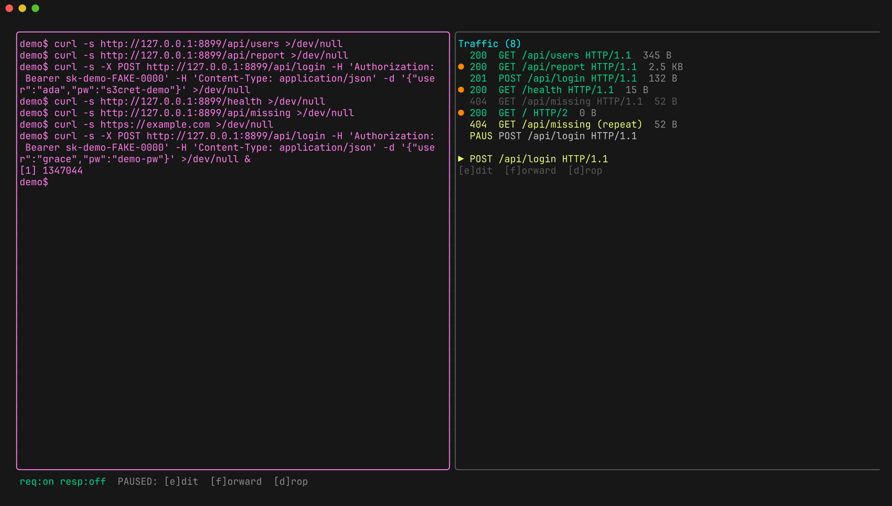
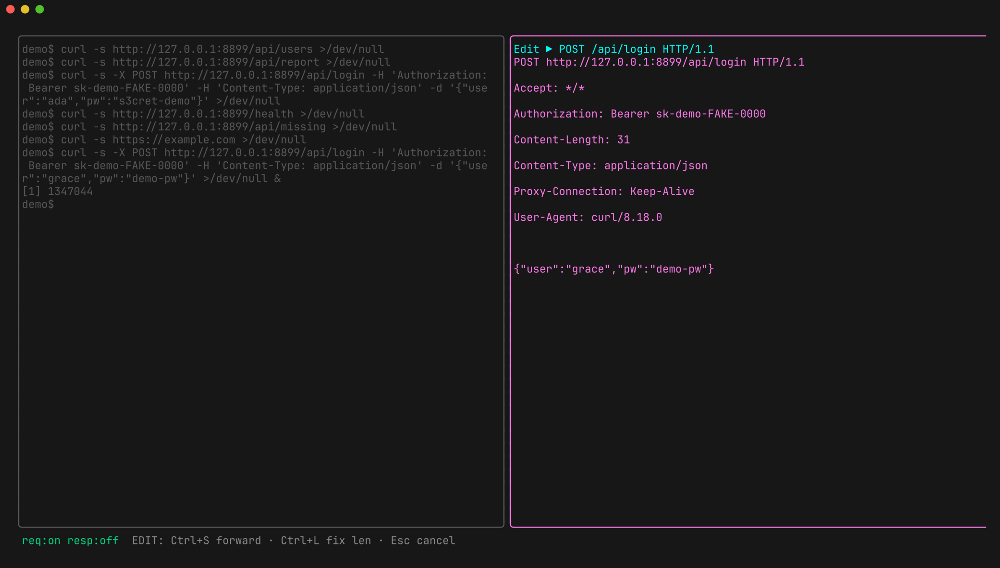

# Intercepting & tampering

Interception is **off by default** — cli-capture records until you arm it, so
you can start a target, watch what it does, and only then decide to interfere.

## The loop

1. **Arm it.** `Ctrl+A i` for requests, `Ctrl+A r` for responses. The status
   bar switches from `monitor` to `req:on resp:off`. (In the traffic pane, `i`
   and `r` work without the leader.)
2. **Wait for a match.** The next flow that's [in scope](scope.md) stops with
   status **`PAUSED`** and shows its choices inline.
3. **Decide.** `f` forwards it unchanged, `d` drops it, `e` opens the editor.



Nothing else stalls while a flow is held — other connections keep flowing, and
the target's terminal stays live in the left pane.

## Editing

`e` opens the raw bytes in an editor. Change anything — method, path, headers,
body — then:

| Key | Action |
|---|---|
| `Ctrl+S` | forward the edited bytes |
| `Ctrl+L` | rewrite `Content-Length` to match the body you now have |
| `esc` | cancel, leaving the flow paused |



`Ctrl+L` exists because a hand-edited body and a stale `Content-Length` is the
single most common way to make a server hang up on you.

## What "edit" means per protocol

| Protocol | Granularity |
|---|---|
| HTTP/1.1 | the full request or response — headers and body |
| HTTP/2 (unary) | body only, buffered end to end |
| gRPC | body per message, in flight, so streams don't stall |
| WebSocket | per frame, plus live injection |

Header editing isn't wired for HTTP/2 — that's a known gap, not a design
choice. HTTP/1 is the path to use when you need to change a header.

## WebSocket injection

You don't have to wait for a frame to intercept. In the traffic pane, `n`
injects a frame **client→server** and `N` injects **server→client**, on the
selected WebSocket flow — a way to send something the client would never send,
or to hand the client something the server never sent.

## Scope keeps it manageable

Arming interception with no scope pauses *everything*, which on a chatty target
means holding the world. Narrow it first:

```bash
# only pause the API calls you care about
cli-capture -scope 'path:/v1/*' -- some-cli
```

See [scope](scope.md) for the grammar and the allowlist/denylist postures.

## Limits worth knowing

- **HTTP/2 header editing** isn't implemented (body only).
- The editor is a **text** field — editing binary or protobuf bodies is clumsy;
  JSON and text are fine.
- **HTTP/2 responses that are only observed** (not intercepted) stream without
  buffering, so their bodies don't land in the detail view. Arm response
  interception if you need one.
- Targets that **pin certificates** can't be MITM'd at all, so nothing to
  intercept — see [getting started](getting-started.md#when-nothing-shows-up).
