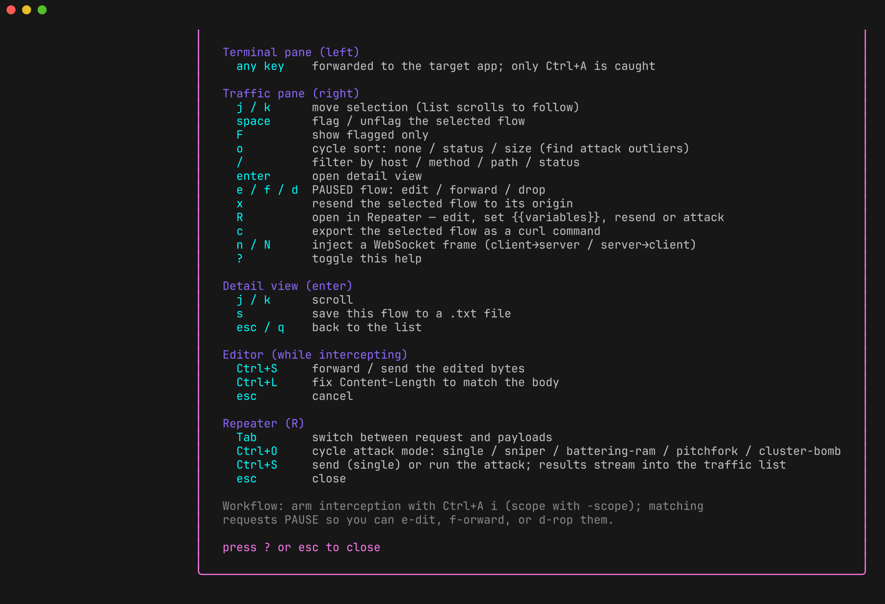

# Keybindings

The left pane is a real terminal, so cli-capture can't take plain keys for
itself — the target needs them. It uses a **tmux-style leader**: `Ctrl+A`, then
a command key. Everything else goes straight through to the target. Press
`Ctrl+A` twice to send a literal `Ctrl+A`.

Press **`?`** for this reference in-app:

## Global — `Ctrl+A`, then:

| Key | Action |
|---|---|
| `w` | switch pane (terminal ⇄ traffic) |
| `<` / `>` | resize the split: shrink / grow the left pane |
| `i` / `r` | toggle intercept: requests / responses |
| `s` | save session to JSON |
| `h` | export session as HAR |
| `f` | export flagged flows → `flagged.txt` |
| `?` | toggle help |
| `q` | quit |
| `Ctrl+A` | send a literal `Ctrl+A` to the target |

## Terminal pane (left)

Every keystroke is forwarded to the target verbatim. Only the leader is caught.

## Traffic pane (right)

Plain keys — no leader needed, because this pane never forwards to the target.

| Key | Action |
|---|---|
| `j` / `k` (or `↓` / `↑`) | move the selection; the list scrolls to follow |
| `space` | flag / unflag the selected flow |
| `F` | show flagged only |
| `o` | cycle sort: none → status → size |
| `/` | filter by host / method / path / status / protocol |
| `enter` | open the detail view |
| `i` / `r` | toggle intercept: requests / responses (same as the leader form) |
| `e` / `f` / `d` | on a **PAUSED** flow: edit / forward / drop |
| `x` | resend the selected flow to its origin |
| `R` | open the flow in the [Repeater](repeater.md) |
| `c` | export the selected flow as a curl command |
| `n` / `N` | inject a WebSocket frame (client→server / server→client) |
| `?` | toggle help |

## Detail view (`enter`)

| Key | Action |
|---|---|
| `j` / `k` | scroll |
| `s` | save this flow to a `.txt` file |
| `esc` / `q` | back to the list |

## Editor (while [intercepting](intercepting.md))

| Key | Action |
|---|---|
| `Ctrl+S` | forward / send the edited bytes |
| `Ctrl+L` | fix `Content-Length` to match the body |
| `esc` | cancel |

## Repeater (`R`)

| Key | Action |
|---|---|
| `Tab` | cycle focus: request → payloads → response |
| `Ctrl+O` | cycle attack mode: single / sniper / battering-ram / pitchfork / cluster-bomb |
| `Ctrl+S` | send (single) or run the attack |
| `esc` | close |

## The status bar

The left chip shows interception state: **`monitor`** while nothing is armed,
and **`req:on resp:off`** (or any combination) once it is. The rest of the bar
is the last action's result — where a file was written, how many flows were
saved, whether a flow was forwarded or dropped.
