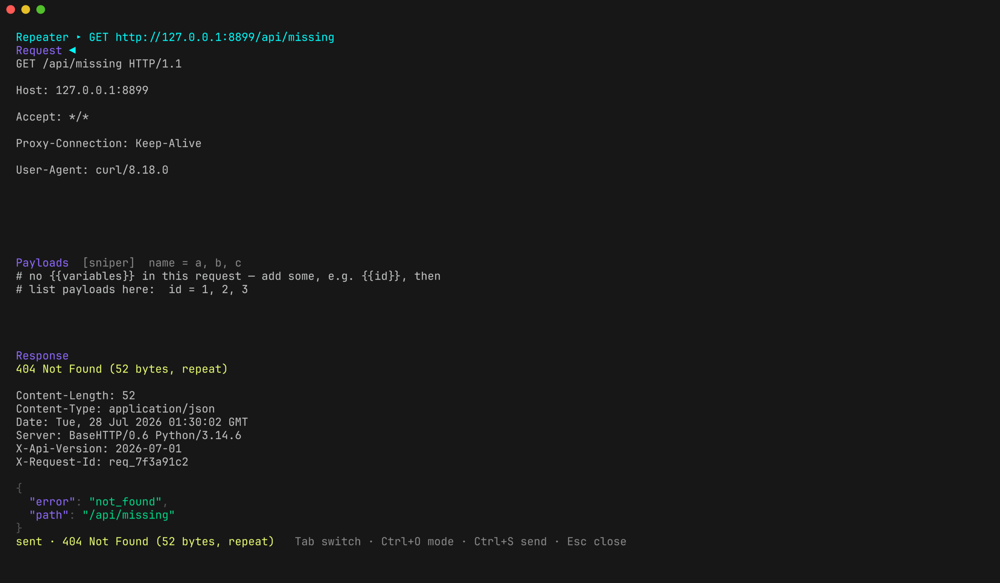
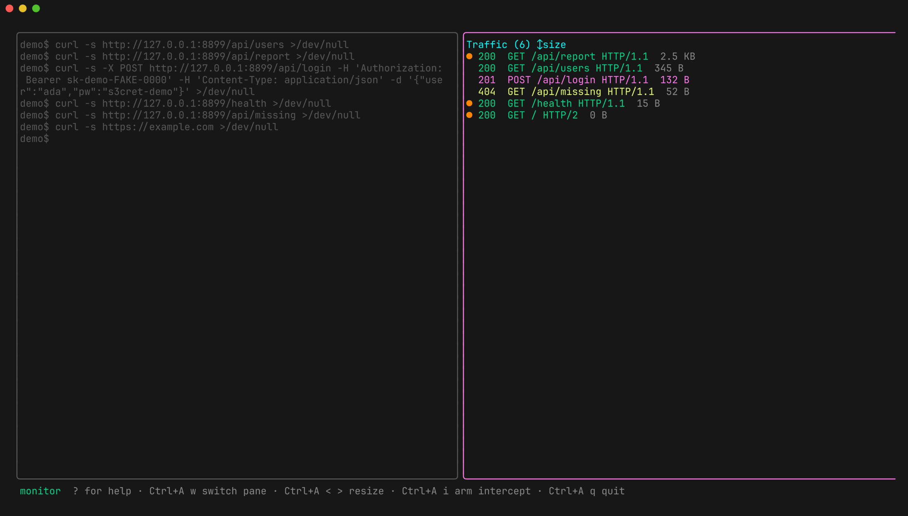

# Repeater & attacks

`R` on a selected flow opens it in the Repeater as an editable request. Edit,
`Ctrl+S`, and the response renders inline underneath — no round trip through
the flow list to read it.


`Tab` cycles focus: **request → payloads → response**. `esc` closes.

Only request/response flows are repeatable — HTTP/1.1, HTTP/2, and gRPC. There's
nothing meaningful to "resend" for a WebSocket stream or a raw TCP passthrough.

> For a plain resend with no edits, `x` in the traffic list sends the selected
> flow to its origin again and drops the result into the list.

## Variables

Write `{{name}}` anywhere in the URL, a header value, or the body. Names may
contain letters, digits, `_`, `.`, and `-`; whitespace inside the braces is
fine (`{{ name }}`). An unfilled variable is left as the literal `{{name}}`
rather than becoming empty, so you can see what you forgot.

Give each one a payload list in the payloads pane:

```
user = ada, grace, alan
role = admin, guest

# blank lines and #-comments are ignored
```

One `name = a, b, c` per line; values are comma-separated and trimmed. In
**single** mode each variable takes the first value in its list, so the payload
pane doubles as a place to park values you're iterating on by hand.

## Attack modes

`Ctrl+O` cycles the mode. Only variables that actually have a payload list
become insertion points; the rest hold at their first value as a baseline.



| Mode | Pairing | Requests sent |
|---|---|---|
| `single` | no expansion — one request | 1 |
| `sniper` | one position at a time, others at baseline | Σ of all list lengths |
| `battering-ram` | the same payload in every position at once | length of the first list |
| `pitchfork` | every list advanced in lockstep | length of the shortest list |
| `cluster-bomb` | cartesian product of every list | product of all list lengths |

Cluster-bomb multiplies fast — three lists of ten is a thousand requests
against someone's API. Check the numbers before `Ctrl+S`.

## Reading the results

`Ctrl+S` runs the attack off the UI thread, and every result streams into the
traffic list as a normal flow — tagged with the payload that produced it, so
the list doubles as the results table. The UI stays responsive while it runs.

That's what `o` (cycle sort) is for: sort by **size** or **status** and the
outlier surfaces immediately — the one payload that returned a different length
or a different code from the other 199.



Flag the interesting rows with `space` as you go, then `Ctrl+A f` writes just
those to `flagged.txt`. See [exporting](exporting.md).
