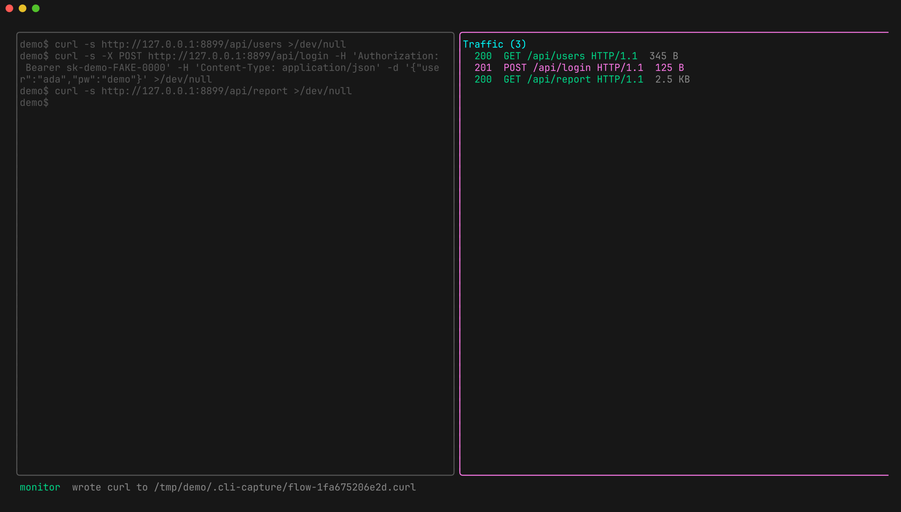
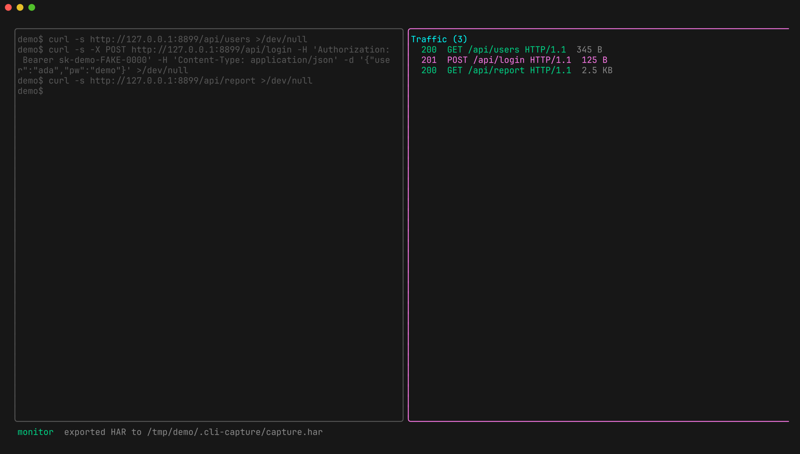

# cli-capture — a visual tour

A walk through cli-capture's features, with a screenshot of each. Every shot was
taken by pointing cli-capture at a plain shell and driving traffic against a
small local demo API:

```bash
cli-capture -- bash
# then, inside the target shell:
curl -s http://127.0.0.1:8899/api/users
curl -s -X POST http://127.0.0.1:8899/api/login \
  -H 'Authorization: Bearer sk-demo-FAKE-0000' \
  -H 'Content-Type: application/json' \
  -d '{"user":"ada","pw":"s3cret-demo"}'
```

> All tokens, users, and passwords shown are **synthetic demo values** — the
> `sk-demo-FAKE-0000` bearer exists only to show how auth headers are captured.

The leader key is **`Ctrl+A`** (tmux-style). Press **`?`** any time for the help
overlay.

---

## The split-pane monitor

Your target program runs in the left pane exactly as it would in a normal
terminal; every request it makes streams into the traffic list on the right,
each row colored by status class and annotated with method, path, protocol
(HTTP/1.1 **and** HTTP/2), and response size.


## Full request / response detail — with JSON highlighting

Press **`enter`** on any flow to open the detail view. Request and response
headers are laid out in full, and JSON bodies are pretty-printed and
syntax-highlighted. `j`/`k` scroll, `esc` goes back.


## Request headers and body

The detail view shows the outgoing request too — here a `POST` with its
`Authorization` header and JSON body captured verbatim.


## On-the-fly decompression

`gzip`, `deflate`, `br`, and `zstd` responses are decoded automatically — the
header still shows `Content-Encoding: gzip`, but the body is displayed decoded
and highlighted.


## Filter the list

Press **`/`** and type to filter by host, method, path, or status. The header
shows how many of the total flows match.


## Flag flows

Press **`space`** to flag/unflag the selected flow; flagged rows get a marker so
you can build up a working set as you triage.


## …then focus on just the flagged ones

Press **`F`** to show only flagged flows.


## Sort to surface outliers

Press **`o`** to cycle sort: none → status → size. Sorting by size (or status)
quickly surfaces the outlier response — invaluable when reading attack results.


## Repeater — resend and tamper, with the response inline

Press **`R`** to open a flow in the Repeater. Edit the request on the left, hit
**`Ctrl+S`** to send, and the response renders inline underneath. `Tab` cycles
request → payloads → response.


## Attack modes

**`Ctrl+O`** cycles the attack mode — `single`, `sniper`, `battering-ram`,
`pitchfork`, `cluster-bomb`. Add `{{variables}}` to the request and list payloads
below; running the attack streams a result row per payload into the traffic list
(then sort with `o` to find the outlier).


## Intercept: pause a request in flight

Arm interception with **`Ctrl+A i`** (requests) or **`Ctrl+A r`** (responses).
Matching traffic PAUSES so you can act on it — the held flow shows
`[e]dit  [f]orward  [d]rop`.


## …edit the raw bytes before forwarding

Press **`e`** on a paused flow to open the editor. Change anything — path,
headers, body — then **`Ctrl+S`** to forward the edited bytes (**`Ctrl+L`** fixes
`Content-Length` for you), or **`Esc`** to cancel.


## Built-in help

**`?`** toggles a full keybinding reference, grouped by context.


## Export a single flow as a curl command

Press **`c`** to write the selected flow out as a runnable `curl` command.



## Export the whole session as HAR

**`Ctrl+A h`** exports every captured flow to a HAR file (openable in browser
devtools and other tooling); **`Ctrl+A s`** saves a replayable JSON session.



---

### Not pictured

A few capabilities need extra infrastructure to demo and aren't shown here:
WebSocket frame injection (`n`/`N`), gRPC message inspection, and transparent
(nftables) capture on Linux. See the [README](../README.md) for those.
